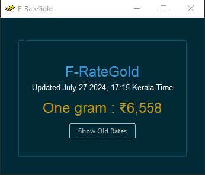

# F-RateGold

F-RateGold is a Python application that fetches and displays gold rates using BeautifulSoup and sends notifications for rate updates. The application uses `ttkbootstrap` for the GUI and `plyer` for notifications.

## Features

- Fetches gold rates from the web.
- Displays the current rate and last update time.
- Saves historical rates to a CSV file.
- Shows historical rates in a separate window.
- Sends notifications for significant rate changes.
## Screenshot


## Requirements

- `ttkbootstrap`
- `beautifulsoup4`
- `requests`
- `pandas`
- `plyer`
- `tkinter` (included with Python)

## Setup

1. Install the required packages:

    ```bash
    pip install ttkbootstrap beautifulsoup4 requests pandas plyer
    ```

2. Place the `fetch_gold_rates.py` script, `gold_rates.csv`, and `icon.ico` in the same directory.

3. Run the script:

    ```bash
    python fetch_gold_rates.py
    ```

## Usage

- The application fetches the gold rate from a specified URL.
- Displays the rate and last update time on the main window.
- Shows historical rates when "Show Old Rates" is clicked.
- Sends notifications when the gold rate is less than or equal to 6300.

## License

This project is licensed under the MIT License.
